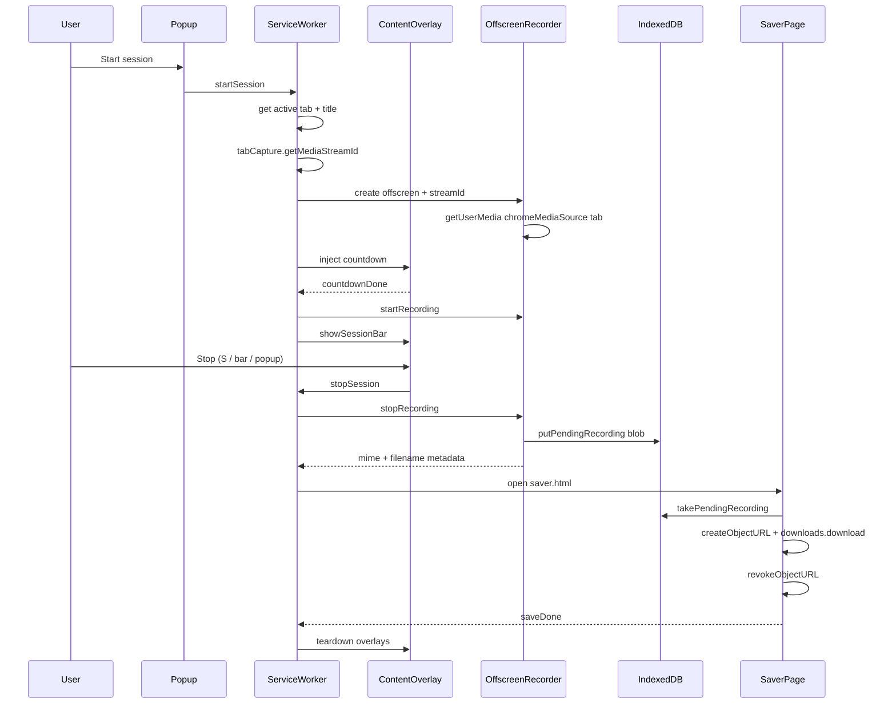

# Exergy ∞ xFrame 

**Exergy ∞ xFrame** is a minimal Chrome extension that captures an MP4 (or WebM fallback) of the current tab’s web session: a brief countdown, optional on-page controls, then Stop & save to Downloads.

An animated explainer lives at [`index.html`](index.html).

## Load unpacked

1. Open Chrome → **Extensions** → enable **Developer mode**
2. Click **Load unpacked**
3. Select the [`extension/`](extension/) directory in this repository

## Usage

1. Open the website tab you want to capture
2. Click the Exergy ∞ xFrame toolbar icon
3. Choose options, then **Start session**
4. Watch the on-page countdown (3 → 2 → 1)
5. Work as usual; pause or stop when done
6. The recording downloads as `{tab title} {YYYY-MM-DD HH_MM}.mp4` (or `.webm` if MP4 is unavailable)

### Start options

| Option | Default | Effect |
| --- | --- | --- |
| Include Exergy logo in recording | On | Watermark in the top-right of the capture |
| Hide recording controls from the video | On | Omits the on-page session bar from the recording; reopen the popup (or use keys) to pause/stop |
| Include mouse pointer in recording | Off | Draws a captureable pointer overlay; otherwise the cursor is hidden from the capture |

### During a session

- **P** — pause / continue
- **S** — stop & save
- Reopen the toolbar popup for the live timer plus Pause and Stop & save buttons
- If “Hide recording controls” is off, the on-page session bar also offers pause/stop

Keys are ignored while typing in inputs, textareas, or contenteditable fields.

**Estimated size:** about **0.3–1 MB per second** of capture (~18–60 MB per minute), depending on tab resolution, motion, audio, and whether Chrome encodes MP4 or WebM at its default MediaRecorder bitrate. Quiet static pages land near the low end; busy or full-HD tabs trend higher.

## Session flow

Start acquires the tab stream and prepares the offscreen recorder before the countdown. Encoding begins only after the countdown finishes so the digits are not recorded. Stop writes the recording to IndexedDB, then the service worker downloads it.

### Walkthrough

1. **Start** — The popup asks the service worker to begin a session on the active tab (with the chosen options).
2. **Acquire** — The worker obtains a `tabCapture` stream id, opens an offscreen document, and the recorder calls `getUserMedia` with the tab media source (video + tab audio when available). Tab audio is also routed to the local `AudioContext` so you can still hear the page. Capture requests `cursor: never` unless “Include mouse pointer” is on.
3. **Countdown** — A content overlay counts down for about three seconds.
4. **Record** — After the overlay clears, `MediaRecorder` starts (MP4 when the browser can actually record it; otherwise WebM). The native cursor is hidden on the page; optional logo / pointer overlays and session UI follow the start options.
5. **Stop & save** — The offscreen recorder stores the blob in IndexedDB. A short-lived `saver.html` page (needed because service workers lack `URL.createObjectURL`) reads the blob, downloads it via `chrome.downloads`, revokes the URL, and closes.

## Notes

- Chrome only (Manifest V3). Restricted pages such as `chrome://` URLs cannot be captured.
- Declares `host_permissions` for `<all_urls>` so `tabCapture.getMediaStreamId` can target the active tab reliably (in addition to `activeTab` from the popup gesture).
- Prefer native `MediaRecorder` MP4 (`video/mp4`). If MP4 is advertised but fails to start, or is unsupported, the extension falls back to WebM and uses a `.webm` extension.
- Recordings move offscreen → IndexedDB → `saver.html` → `chrome.downloads` (not Base64 data URLs, and not `createObjectURL` in the service worker). The saver page revokes the temporary `blob:` URL after the download completes.
- No npm runtime dependencies; the extension is plain HTML/CSS/JS.

## Chrome Web Store package

The [`Package Chrome extension`](.github/workflows/package-extension.yml) workflow zips the contents of [`extension/`](extension/) (with `manifest.json` at the archive root) as `exergy-frame-<version>.zip`.

- On pushes/PRs to `main`, the zip is uploaded as a workflow artifact
- On a published GitHub Release, the same zip is attached to that release for Chrome Web Store upload

## Brand assets

Packaged under [`extension/assets/`](extension/assets/) from the repo root:

- `favicon.ico`
- `favicon.svg`
- `exergy_connect_logo.png`
